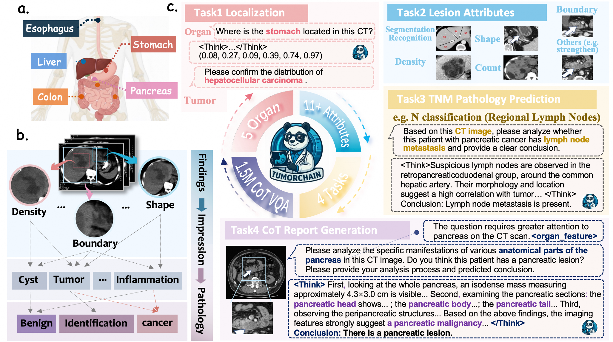
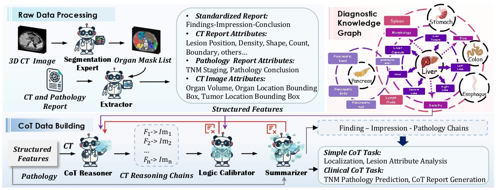
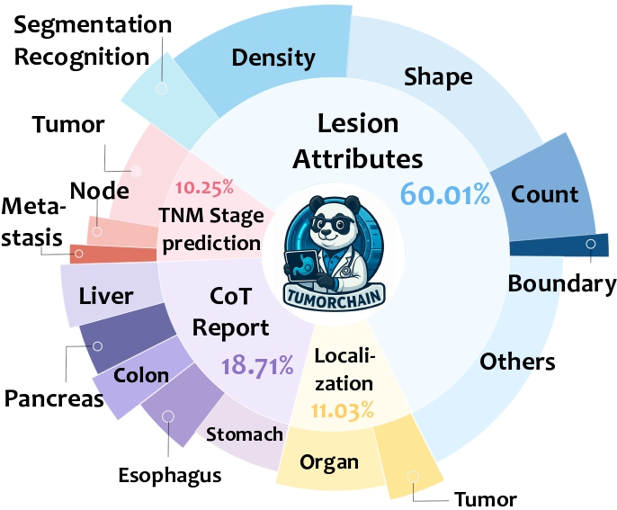
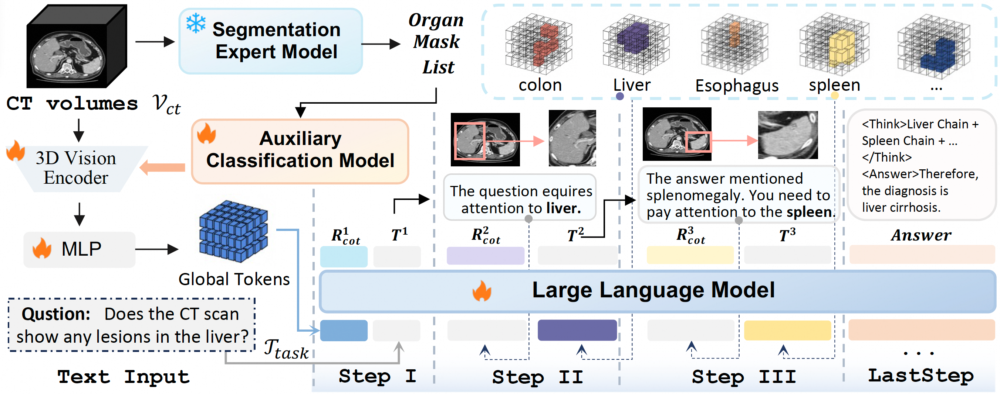

<h1 align = "center">
TumorChain: Interleaved Multimodal Chain-of-Thought Reasoning for Traceable Clinical Tumor Analysis
</h1>
Official Repo for Paper ‘’TumorChain: Interleaved Multimodal Chain-of-Thought Reasoning for Traceable Clinical Tumor Analysis‘’

Sijing Li1,2*, Zhongwei Qiu2,3,1*, Jiang Liu1, Wenqiao Zhang1†, Tianwei Lin1,2,  
Yihan Xie1, Jianxiang An1, Boxiang Yun2, Chenglin Yang1, Jun Xiao1, Guangyu Guo2,1,  
Jiawen Yao2, Wei Liu2, Yuan Gao2, Ke Yan2, Weiwei Cao2, Zhilin Zheng2  
Tony C. W. MOK2, Kai Cao4, Yu Shi5, Jiuyu Zhang5, Jian Zhou6  
Beng Chin Ooi1, Yingda Xia†2, Ling Zhang2  

1Zhejiang University 2DAMO Academy, Alibaba Group 3Hupan Lab
4Shanghai Institution of Pancreatic Disease 5Shengjing Hospital of China Medical University 6Sun Yat-sen University Cancer Center
 

## 🌟 Overview

Welcome to **TumorChain!** 

Our goal is to advance clinical tumor analysis through reliable multimodal reasoning at scale. This project presents a cohesive three-part framework—Dataset, Benchmark, and Model—to enable safe, explainable, and reproducible tumor assessment in high-stakes settings.

  

##### :clap: Core Vision:

- Establish a closed-loop multimodal reasoning pipeline that standardizes the path from findings to impressions to pathology.
- Create high-quality benchmarks and reproducible evaluation protocols to enable cross-institution comparison and robust generalization.
- Deliver an interpretable, calibrated, and traceable multimodal framework that reduces hallucinations and supports real-world clinical decision-making.

## :mailbox: Data collection and statistics

We introduce TumorCoT-1.5M — a large-scale dataset comprising 1.5 million Chain-of-Thought (CoT) labeled VQA prompts, paired with 3D CT scans, featuring stepwise reasoning and cross-modal alignments along the findings–impression–pathology trajectory.

## :ferris_wheel: Model Architecture

TumorChain is a **multi-modal, iterative interleaved reasoning framework** for 3D CT tumor analysis that fuses a 3D vision encoder, organ segmentation model, auxiliary classification model, an MLP projector, and a large language model (LLM) to perform stepwise, evidence-grounded reasoning from findings to impressions to pathology, with traceable evidence and calibrated uncertainty.

  

## 🛠️ Getting Started
😊 We will release our task definitions, benchmarks, and evaluation protocols in the near future to advance safe, explainable, and reproducible multimodal reasoning for high-stakes tumor analysis. 🚀
